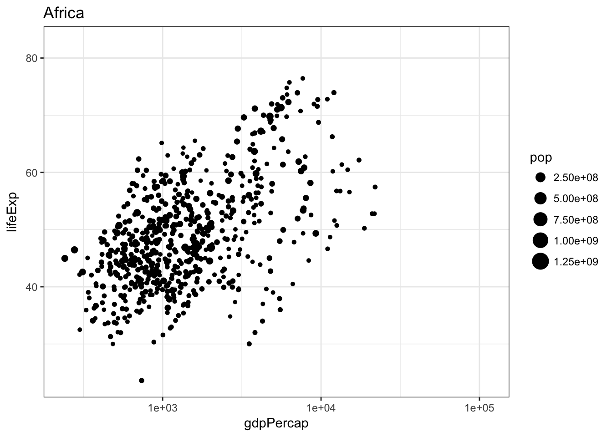
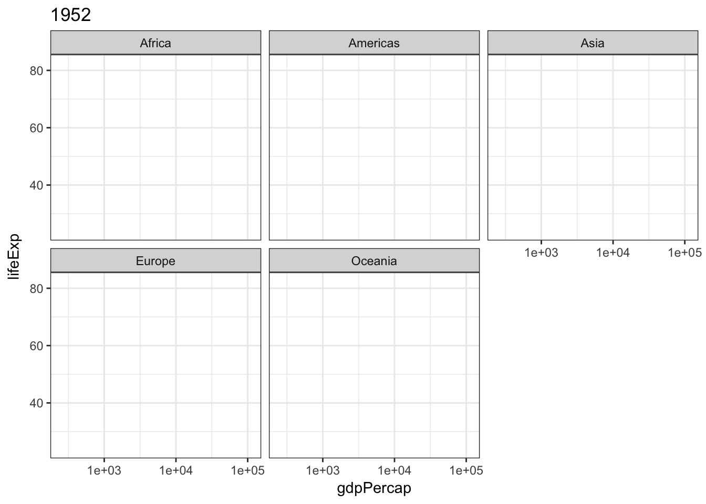

## gganimate: Create easy animations with ggplot2

<!-- README.md is generated from README.Rmd. Please edit that file -->


**gganimate** wraps the [animation package](https://mran.microsoft.com/package/animation/) to create animated ggplot2 plots. It can be installed using [devtools](https://github.com/hadley/devtools):

```
devtools::install_github("dgrtwo/gganimate")
```

The core of the approach is to treat "frame" (as in, the time point within an animation) as another aesthetic, just like **x**, **y**, **size**, **color**, or so on. Thus, a variable in your data can be mapped to frame just as others are mapped to x or y.

For example, suppose we wanted to create an animation similar to the [Gapminder world](http://www.gapminder.org/world) animation, using Jenny Bryan's [gapminder](https://github.com/jennybc/gapminder) package for the data.


```r
library(gapminder)
library(ggplot2)
theme_set(theme_bw())
```


```r
p <- ggplot(gapminder, aes(gdpPercap, lifeExp, size = pop, color = continent, frame = year)) +
  geom_point() +
  scale_x_log10()
```

Notice we added `frame = year` and saved the plot as `p`. We then display it as an animation with the `gganimate` function:


```r
library(gganimate)

gganimate(p)
```


This creates a animation you can view within RStudio. When run within knitr (and combined with knitr's `fig.show = "animate"` chunk option), it instead displays each of the figures in sequence to let knitr create an animation as seen above.

You can also save the animation to a file, such as an GIF, video, or an animated webpage:


```r
gganimate(p, "output.gif")
gganimate(p, "output.mp4")
gganimate(p, "output.swf")
gganimate(p, "output.html")
```

(Each of these requires ffmpeg, ImageMagick, or other such drivers to be installed on your computer: see the [animation package](https://mran.microsoft.com/package/animation/) documentation for more).

Notice that the axis limits and legend stay fixed between animation frames, even though the points move. This is one of the advantages of the **gganimate** package as opposed to creating each ggplot separately and combining them with the **animation** package: the plot (with its axes and legend) is built only once but rendered for each frame.

### Customization

You can have some layers of your plot animated and others not, simply by adding the `frame` aesthetic to those layers and not others. This is useful, for example, if you want to *highlight* particular points in an animation rather than move them. 


```r
p2 <- ggplot(gapminder, aes(gdpPercap, lifeExp, size = pop)) +
  geom_point() +
  geom_point(aes(frame = year), color = "red") +
  scale_x_log10()

gganimate(p2)
```


You could also make a layer cumulative by adding an aesthetic `cumulative = TRUE`, which is useful for building up an object or path over time.


```r
p3 <- ggplot(gapminder, aes(gdpPercap, lifeExp, frame = year)) +
  geom_path(aes(cumulative = TRUE, group = country)) +
  scale_x_log10() +
  facet_wrap(~continent)

gganimate(p3)
```


Note that while it's intuitive to match `frame` to a "time" dimension, you could match any variable in your data to the `frame` aesthetic. We could animate across continents instead:


```r
p4 <- ggplot(gapminder, aes(gdpPercap, lifeExp, size = pop, frame = continent)) +
  geom_point() +
  scale_x_log10()

gganimate(p4)
```



Note that if there is a stat summarization (such as a `geom_smooth`) that you want to animate, you should also add a `group` aesthetic to that layer. Otherwise, the layer will be calculated once across all frames (and therefore be constant in the animation):


```r
p5 <- ggplot(gapminder, aes(gdpPercap, lifeExp, size = pop, frame = year)) +
  geom_point() +
  geom_smooth(aes(group = year), method = "lm", show.legend = FALSE) +
  facet_wrap(~continent, scales = "free") +
  scale_x_log10()

gganimate(p5)
```


Finally, note that you can control your animation with the same options described in [ani.options](https://www.rforge.net/doc/packages/animation/ani.options.html), passed directly to `gganimate` or to `ani.options` beforehand. For example, you could make the plot faster or slower with the `interval` argument:


```r
gganimate(p, interval = .2)
```



However, note that while this works for displaying a plot in RStudio or saving it, within a knitr document you'll need to add `interval = .2` to the chunk options. Other options can be added with `ani.options` run before the chunk in question.
